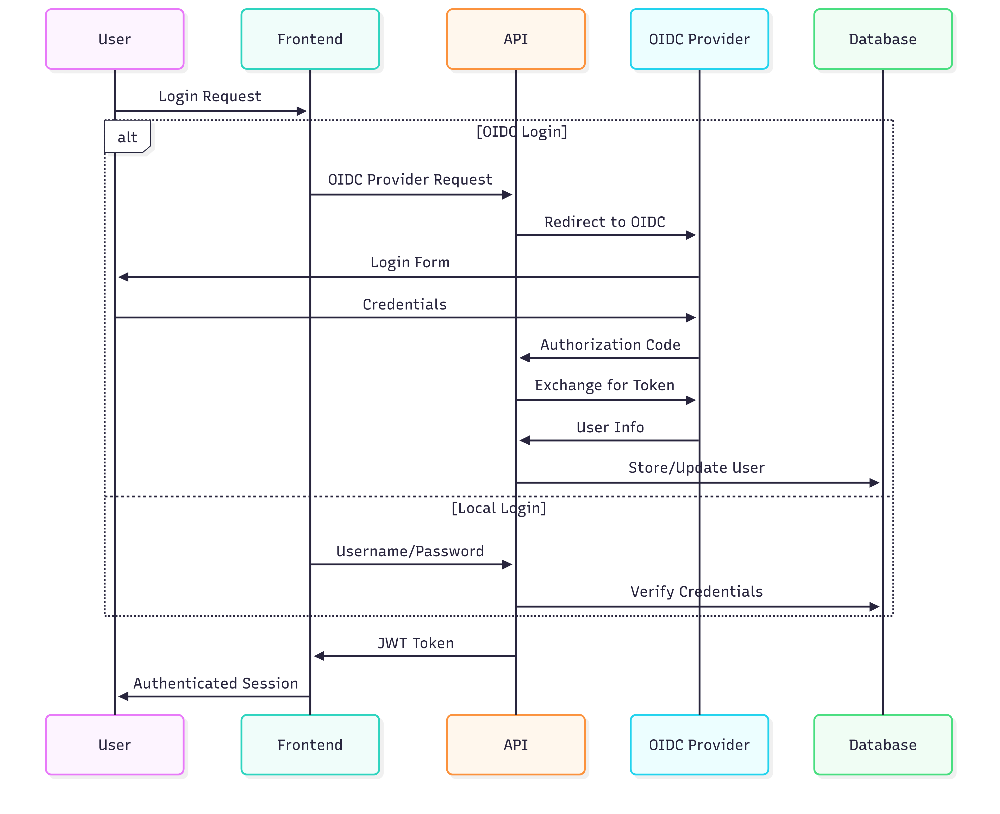

# Authentication

Safebucket supports multiple authentication methods including local authentication and OIDC providers.

## Overview

Safebucket's authentication system provides:

- **Local Authentication**: Username/password with secure password hashing (Argon2id)
- **OIDC Integration**: Support for any OIDC provider (Pocket ID, Authelia, Keycloak, ...)
- **Role-Based Access Control**: Granular permissions with roles and groups
- **Admin Management**: Built-in admin user creation and management
- **Sharing Restrictions**: Control sharing permissions per provider with domain restrictions
- **JWT Tokens**: Stateless authentication

## Authentication Flow



## Local Authentication

Local authentication uses email/password with secure Argon2id password hashing.

### Configuration

#### Environment Variables

```bash
# JWT Configuration
APP__JWT_SECRET=your-256-bit-secret-key

# Admin User
APP__ADMIN_EMAIL=admin@safebucket.io
APP__ADMIN_PASSWORD=ChangeMePlease
```

#### YAML Configuration

```yaml
app:
  jwt_secret: your-256-bit-secret-key
  admin_email: admin@safebucket.io
  admin_password: ChangeMePlease

auth:
  providers:
    local:
      type: local
      sharing:
        allowed: true
```

### Default Admin User

Safebucket automatically creates an admin user on startup:

- **Email**: Configured via `APP__ADMIN_EMAIL`
- **Password**: Configured via `APP__ADMIN_PASSWORD`
- **Role**: Admin (full system access)

:::warning Security Note
**Always change the default admin password in production!**
:::

## OIDC Providers

### Configuration Pattern

On your OIDC provider, set the callback URL to:

```
https://yourdomain.com/api/v1/auth/providers/myprovider/callback
```

#### Environment Variables

```bash
# Enable providers (comma-separated list of provider keys)
AUTH__PROVIDERS__KEYS=myprovider

# Provider configuration (replace MYPROVIDER with your provider key)
AUTH__PROVIDERS__MYPROVIDER__NAME=Display Name
AUTH__PROVIDERS__MYPROVIDER__TYPE=oidc
AUTH__PROVIDERS__MYPROVIDER__OIDC__CLIENT_ID=your-client-id
AUTH__PROVIDERS__MYPROVIDER__OIDC__CLIENT_SECRET=your-client-secret
AUTH__PROVIDERS__MYPROVIDER__OIDC__ISSUER=https://provider-issuer-url
```

#### YAML Configuration

```yaml
auth:
  providers:
    provider_name:
      type: oidc
      name: Display Name
      oidc:
        client_id: your-client-id
        client_secret: your-client-secret
        issuer: https://provider-issuer-url
      sharing:
        allowed: true
        allowed_domains:
          - yourdomain.com
```

### Sharing Restrictions

Restrict sharing to specific email domains or disable it entirely per provider.

#### Environment Variables

```bash
# Enable sharing with domain restrictions
AUTH__PROVIDERS__MYPROVIDER__SHARING__ALLOWED=true
AUTH__PROVIDERS__MYPROVIDER__SHARING__ALLOWED_DOMAINS=company.com,partner.org

# Or disable sharing entirely
AUTH__PROVIDERS__MYPROVIDER__SHARING__ALLOWED=false
```

#### YAML Configuration

```yaml
sharing:
  allowed: true
  allowed_domains:
    - company.com
    - partner.org
```

### Example with Pocket ID

[Pocket ID](https://pocket-id.org) is a simple, self-hosted OIDC provider with passkey support.

1. **Create an OIDC client** in your Pocket ID admin panel
2. **Set the callback URL** to:
   ```
   https://yourdomain.com/api/v1/auth/providers/pocketid/callback
   ```
3. **Copy your Client ID and Client Secret**

```bash
AUTH__PROVIDERS__KEYS=pocketid
AUTH__PROVIDERS__POCKETID__NAME=Pocket ID
AUTH__PROVIDERS__POCKETID__TYPE=oidc
AUTH__PROVIDERS__POCKETID__OIDC__CLIENT_ID=your-client-id
AUTH__PROVIDERS__POCKETID__OIDC__CLIENT_SECRET=your-client-secret
AUTH__PROVIDERS__POCKETID__OIDC__ISSUER=https://auth.yourdomain.com
```

### Other Providers

#### Authelia

Callback URL: `https://yourdomain.com/api/v1/auth/providers/authelia/callback`

```bash
AUTH__PROVIDERS__KEYS=authelia
AUTH__PROVIDERS__AUTHELIA__NAME=Authelia
AUTH__PROVIDERS__AUTHELIA__TYPE=oidc
AUTH__PROVIDERS__AUTHELIA__OIDC__CLIENT_ID=safebucket
AUTH__PROVIDERS__AUTHELIA__OIDC__CLIENT_SECRET=your-secret
AUTH__PROVIDERS__AUTHELIA__OIDC__ISSUER=https://auth.yourdomain.com
```

#### Keycloak

Callback URL: `https://yourdomain.com/api/v1/auth/providers/keycloak/callback`

```bash
AUTH__PROVIDERS__KEYS=keycloak
AUTH__PROVIDERS__KEYCLOAK__NAME=Keycloak
AUTH__PROVIDERS__KEYCLOAK__TYPE=oidc
AUTH__PROVIDERS__KEYCLOAK__OIDC__CLIENT_ID=safebucket
AUTH__PROVIDERS__KEYCLOAK__OIDC__CLIENT_SECRET=your-secret
AUTH__PROVIDERS__KEYCLOAK__OIDC__ISSUER=https://keycloak.yourdomain.com/realms/your-realm
```

### Multiple Providers

```bash
AUTH__PROVIDERS__KEYS=local,pocketid,authelia

# Pocket ID
AUTH__PROVIDERS__POCKETID__NAME=Pocket ID
AUTH__PROVIDERS__POCKETID__TYPE=oidc
AUTH__PROVIDERS__POCKETID__OIDC__CLIENT_ID=pocketid-client-id
AUTH__PROVIDERS__POCKETID__OIDC__CLIENT_SECRET=pocketid-secret
AUTH__PROVIDERS__POCKETID__OIDC__ISSUER=https://auth.yourdomain.com

# Authelia
AUTH__PROVIDERS__AUTHELIA__NAME=Company SSO
AUTH__PROVIDERS__AUTHELIA__TYPE=oidc
AUTH__PROVIDERS__AUTHELIA__OIDC__CLIENT_ID=safebucket
AUTH__PROVIDERS__AUTHELIA__OIDC__CLIENT_SECRET=authelia-secret
AUTH__PROVIDERS__AUTHELIA__OIDC__ISSUER=https://sso.company.com
```

Users can choose their preferred authentication method on the login page.

## Role-Based Access Control (RBAC)

### Built-in Roles

1. **Guest**: Read-only access to shared resources
2. **User**: Can create and share buckets, upload files
3. **Admin**: Full system access, user management

### Role Assignment

- **Local Users**: Assigned "User" role by default
- **OIDC Users**: Assigned "User" role by default
- **Admin User**: Assigned "Admin" role automatically
