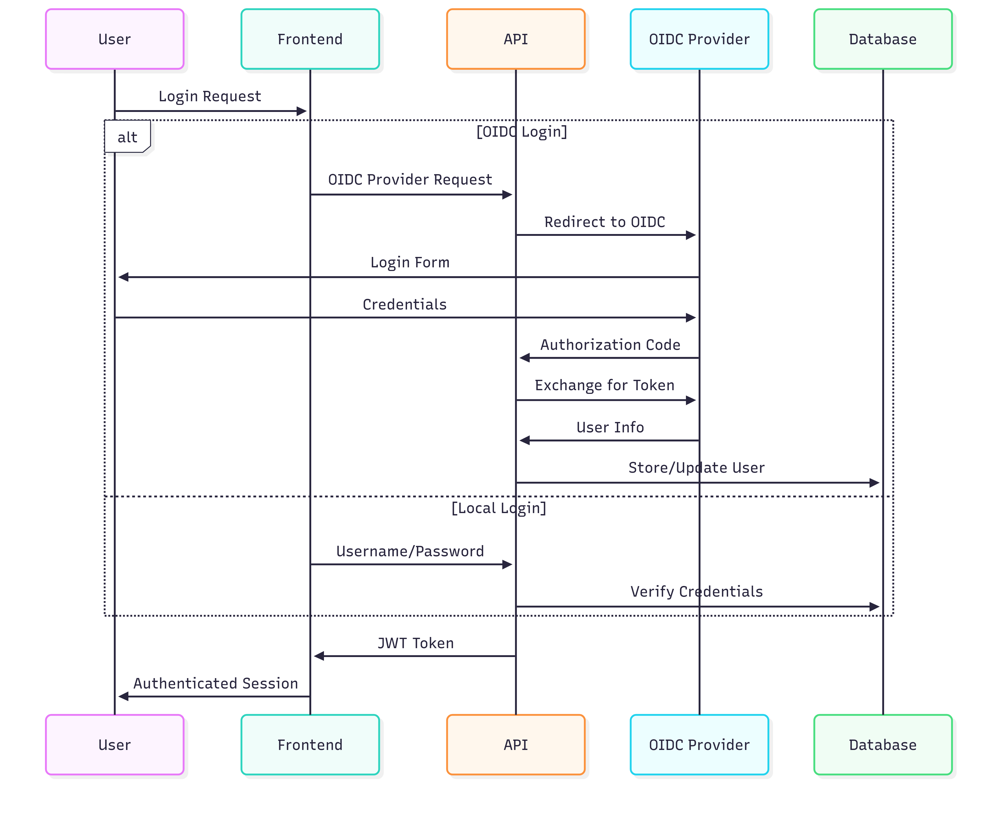

# Authentication

Safebucket supports multiple authentication methods including local authentication, OIDC providers, and LDAP. This guide covers configuration for various authentication options.

## Overview

Safebucket's authentication system provides:

- **Local Authentication**: Username/password with Argon2id hashing
- **OIDC Integration**: Support for any OIDC provider (Pocket ID, Authelia, Keycloak, Google, GitHub, custom OIDC)
- **LDAP Integration**: Authenticate against an LDAP directory or Active Directory
- **Role-Based Access Control**: Granular permissions with roles and groups
- **Admin Management**: Built-in admin user creation and management
- **Sharing Restrictions**: Control sharing permissions per provider with domain restrictions
- **Encrypted tokens**: HS256-signed JWS wrapped in a JWE. Both the payload and the signature are unreadable without the secret.
- **Server-tracked sessions**: Access tokens carry a session ID validated against the cache on every request, so logout and session revocation take effect immediately

## Authentication Flow



## Local Authentication

Local authentication uses email/password with secure Argon2id password hashing.

### Configuration

#### Environment Variables

```bash
# Token signing secret
APP__TOKEN_SECRET=your-256-bit-secret-key

# Admin User
APP__ADMIN_EMAIL=admin@safebucket.io
APP__ADMIN_PASSWORD=ChangeMePlease
```

#### YAML Configuration

```yaml
app:
  token_secret: your-256-bit-secret-key
  admin_email: admin@safebucket.io
  admin_password: ChangeMePlease

auth:
  providers:
    local:
      type: local
      sharing:
        allowed: true
```

### Default Admin User

Safebucket automatically creates an admin user on startup:

- **Email**: Configured via `APP__ADMIN_EMAIL`
- **Password**: Configured via `APP__ADMIN_PASSWORD`
- **Role**: Admin (full system access)

:::warning Security Note
**Always change the default admin password in production!**
:::

## OIDC Providers

Safebucket supports any OpenID Connect provider.

### Configuration Pattern

On your OIDC provider, set the callback URL to:

```text
https://yourdomain.com/api/v1/auth/providers/myprovider/callback
```

#### Environment Variables

```bash
# Enable providers (comma-separated list of provider keys)
AUTH__PROVIDERS__KEYS=myprovider

# Provider configuration (replace MYPROVIDER with your provider key)
AUTH__PROVIDERS__MYPROVIDER__NAME=Display Name
AUTH__PROVIDERS__MYPROVIDER__TYPE=oidc
AUTH__PROVIDERS__MYPROVIDER__OIDC__CLIENT_ID=your-client-id
AUTH__PROVIDERS__MYPROVIDER__OIDC__CLIENT_SECRET=your-client-secret
AUTH__PROVIDERS__MYPROVIDER__OIDC__ISSUER=https://provider-issuer-url
```

#### YAML Configuration

```yaml
auth:
  providers:
    provider_name:
      type: oidc
      name: Display Name
      oidc:
        client_id: your-client-id
        client_secret: your-client-secret
        issuer: https://provider-issuer-url
      sharing:
        allowed: true
        domains:
          - yourdomain.com
```

### Sharing Restrictions

Restrict sharing to specific email domains or disable it entirely per provider.

#### Environment Variables

```bash
# Enable sharing with domain restrictions
AUTH__PROVIDERS__MYPROVIDER__SHARING__ALLOWED=true
AUTH__PROVIDERS__MYPROVIDER__SHARING__DOMAINS=company.com,partner.org

# Or disable sharing entirely
AUTH__PROVIDERS__MYPROVIDER__SHARING__ALLOWED=false
```

#### YAML Configuration

```yaml
auth:
  providers:
    myprovider:
      sharing:
        allowed: true
        domains:
          - company.com
          - partner.org
```

## Provider Examples

### Google

Configure Google for easy user authentication.

#### Prerequisites

1. **Google Cloud Console** project
2. **OAuth 2.0 Client ID** configured
3. **Authorized redirect URIs** set

#### Setup Steps

1. **Create OAuth Application**:
   - Go to [Google Cloud Console](https://console.cloud.google.com)
   - Navigate to APIs & Services > Credentials
   - Create OAuth 2.0 Client ID (Web application)

2. **Configure Redirect URIs**:

   ```text
   http://localhost:3001/api/v1/auth/providers/google/callback  (development)
   https://yourdomain.com/api/v1/auth/providers/google/callback (production)
   ```

3. **Get Credentials**:
   - Client ID: `123456789-abcdef.apps.googleusercontent.com`
   - Client Secret: `your-secret-key`

#### Configuration

```bash
AUTH__PROVIDERS__KEYS=google
AUTH__PROVIDERS__GOOGLE__NAME=Google
AUTH__PROVIDERS__GOOGLE__TYPE=oidc
AUTH__PROVIDERS__GOOGLE__OIDC__CLIENT_ID=your-google-client-id
AUTH__PROVIDERS__GOOGLE__OIDC__CLIENT_SECRET=your-google-client-secret
AUTH__PROVIDERS__GOOGLE__OIDC__ISSUER=https://accounts.google.com
```

### GitHub

Configure GitHub for developer-friendly authentication.

#### Setup Steps

1. **Create OAuth App**:
   - Go to GitHub Settings > Developer settings > OAuth Apps
   - Click "New OAuth App"

2. **Configure Application**:
   - **Application name**: Safebucket
   - **Homepage URL**: `https://yourdomain.com`
   - **Authorization callback URL**:
     `https://yourdomain.com/api/v1/auth/providers/github/callback`

3. **Get Credentials**:
   - Client ID: `your-github-client-id`
   - Client Secret: `your-github-client-secret`

#### Configuration

```bash
AUTH__PROVIDERS__KEYS=github
AUTH__PROVIDERS__GITHUB__NAME=GitHub
AUTH__PROVIDERS__GITHUB__TYPE=oidc
AUTH__PROVIDERS__GITHUB__OIDC__CLIENT_ID=your-github-client-id
AUTH__PROVIDERS__GITHUB__OIDC__CLIENT_SECRET=your-github-client-secret
AUTH__PROVIDERS__GITHUB__OIDC__ISSUER=https://github.com
```

### Pocket ID

[Pocket ID](https://pocket-id.org) is a simple, self-hosted OIDC provider with passkey support.

1. **Create an OIDC client** in your Pocket ID admin panel
2. **Set the callback URL** to:

   ```text
   https://yourdomain.com/api/v1/auth/providers/pocketid/callback
   ```

3. **Copy your Client ID and Client Secret**

```bash
AUTH__PROVIDERS__KEYS=pocketid
AUTH__PROVIDERS__POCKETID__NAME=Pocket ID
AUTH__PROVIDERS__POCKETID__TYPE=oidc
AUTH__PROVIDERS__POCKETID__OIDC__CLIENT_ID=your-client-id
AUTH__PROVIDERS__POCKETID__OIDC__CLIENT_SECRET=your-client-secret
AUTH__PROVIDERS__POCKETID__OIDC__ISSUER=https://auth.yourdomain.com
```

### Authelia

Callback URL: `https://yourdomain.com/api/v1/auth/providers/authelia/callback`

```bash
AUTH__PROVIDERS__KEYS=authelia
AUTH__PROVIDERS__AUTHELIA__NAME=Authelia
AUTH__PROVIDERS__AUTHELIA__TYPE=oidc
AUTH__PROVIDERS__AUTHELIA__OIDC__CLIENT_ID=safebucket
AUTH__PROVIDERS__AUTHELIA__OIDC__CLIENT_SECRET=your-secret
AUTH__PROVIDERS__AUTHELIA__OIDC__ISSUER=https://auth.yourdomain.com
```

### Keycloak

Callback URL: `https://yourdomain.com/api/v1/auth/providers/keycloak/callback`

```bash
AUTH__PROVIDERS__KEYS=keycloak
AUTH__PROVIDERS__KEYCLOAK__NAME=Keycloak
AUTH__PROVIDERS__KEYCLOAK__TYPE=oidc
AUTH__PROVIDERS__KEYCLOAK__OIDC__CLIENT_ID=safebucket
AUTH__PROVIDERS__KEYCLOAK__OIDC__CLIENT_SECRET=your-secret
AUTH__PROVIDERS__KEYCLOAK__OIDC__ISSUER=https://keycloak.yourdomain.com/realms/your-realm
```

### Okta

Callback URL: `https://yourdomain.com/api/v1/auth/providers/okta/callback`

```bash
AUTH__PROVIDERS__KEYS=okta
AUTH__PROVIDERS__OKTA__NAME=Okta
AUTH__PROVIDERS__OKTA__TYPE=oidc
AUTH__PROVIDERS__OKTA__OIDC__CLIENT_ID=your-okta-client-id
AUTH__PROVIDERS__OKTA__OIDC__CLIENT_SECRET=your-okta-secret
AUTH__PROVIDERS__OKTA__OIDC__ISSUER=https://your-domain.okta.com
```

## Multiple Providers

```bash
AUTH__PROVIDERS__KEYS=local,pocketid,authelia

# Pocket ID
AUTH__PROVIDERS__POCKETID__NAME=Pocket ID
AUTH__PROVIDERS__POCKETID__TYPE=oidc
AUTH__PROVIDERS__POCKETID__OIDC__CLIENT_ID=pocketid-client-id
AUTH__PROVIDERS__POCKETID__OIDC__CLIENT_SECRET=pocketid-secret
AUTH__PROVIDERS__POCKETID__OIDC__ISSUER=https://auth.yourdomain.com

# Authelia
AUTH__PROVIDERS__AUTHELIA__NAME=Company SSO
AUTH__PROVIDERS__AUTHELIA__TYPE=oidc
AUTH__PROVIDERS__AUTHELIA__OIDC__CLIENT_ID=safebucket
AUTH__PROVIDERS__AUTHELIA__OIDC__CLIENT_SECRET=authelia-secret
AUTH__PROVIDERS__AUTHELIA__OIDC__ISSUER=https://sso.company.com
```

Users can choose their preferred authentication method on the login page.

## LDAP Providers

Safebucket can authenticate users against an LDAP directory or Active Directory.
The login form posts the username and password to Safebucket, which binds with
the service account (`bind_dn`), finds the user via `user_filter`, then rebinds
as that user to verify the password. On first login, a Safebucket account is
created automatically with the `User` role.

### Configuration

#### Environment Variables

```bash
AUTH__PROVIDERS__KEYS=myldap
AUTH__PROVIDERS__MYLDAP__NAME=Corporate LDAP
AUTH__PROVIDERS__MYLDAP__TYPE=ldap
AUTH__PROVIDERS__MYLDAP__LDAP__URL=ldap://localhost:389
AUTH__PROVIDERS__MYLDAP__LDAP__BIND_DN=cn=admin,dc=example,dc=org
AUTH__PROVIDERS__MYLDAP__LDAP__BIND_PASSWORD=admin
AUTH__PROVIDERS__MYLDAP__LDAP__BASE_DN=ou=users,dc=example,dc=org
AUTH__PROVIDERS__MYLDAP__LDAP__USER_FILTER=(mail=%s)
```

#### YAML Configuration

```yaml
auth:
  providers:
    myldap:
      type: ldap
      name: Corporate LDAP
      domains: []
      mfa_required: false
      ldap:
        url: ldap://localhost:389
        bind_dn: cn=admin,dc=example,dc=org
        bind_password: admin
        base_dn: ou=users,dc=example,dc=org
        user_filter: "(mail=%s)"
        attribute_map:
          email: mail
        start_tls: false
        tls_insecure_skip: false
        connect_timeout_ms: 5000
      sharing:
        allowed: false
        domains: []
```

### LDAP Settings

| Setting               | Description                                                 | Default |
| --------------------- | ----------------------------------------------------------- | ------- |
| `url`                 | LDAP server URL. Use `ldaps://` for implicit TLS            | -       |
| `bind_dn`             | Service account DN used to search the directory             | -       |
| `bind_password`       | Service account password                                    | -       |
| `base_dn`             | Search root for user lookups                                | -       |
| `user_filter`         | Search filter, with `%s` replaced by the submitted username | -       |
| `attribute_map.email` | LDAP attribute to read the user's email from                | `mail`  |
| `start_tls`           | Upgrade a plain `ldap://` connection to TLS via StartTLS    | `false` |
| `tls_insecure_skip`   | Skip TLS certificate verification                           | `false` |
| `connect_timeout_ms`  | Connection timeout in milliseconds                          | `5000`  |

:::warning
Do not enable `tls_insecure_skip` in production. It disables certificate
verification and exposes credentials on the network.
:::

Like other providers, LDAP supports per-provider [MFA enforcement](./mfa) via
`mfa_required` and [sharing restrictions](#sharing-restrictions) via `sharing`.

## Role-Based Access Control (RBAC)

### Built-in Roles

1. **Guest**: Read-only access to shared resources
2. **User**: Can create and share buckets, upload files
3. **Admin**: Full system access, user management

### Role Assignment

- **Local Users**: Assigned "User" role by default
- **OIDC Users**: Assigned "User" role by default
- **Admin User**: Assigned "Admin" role automatically
