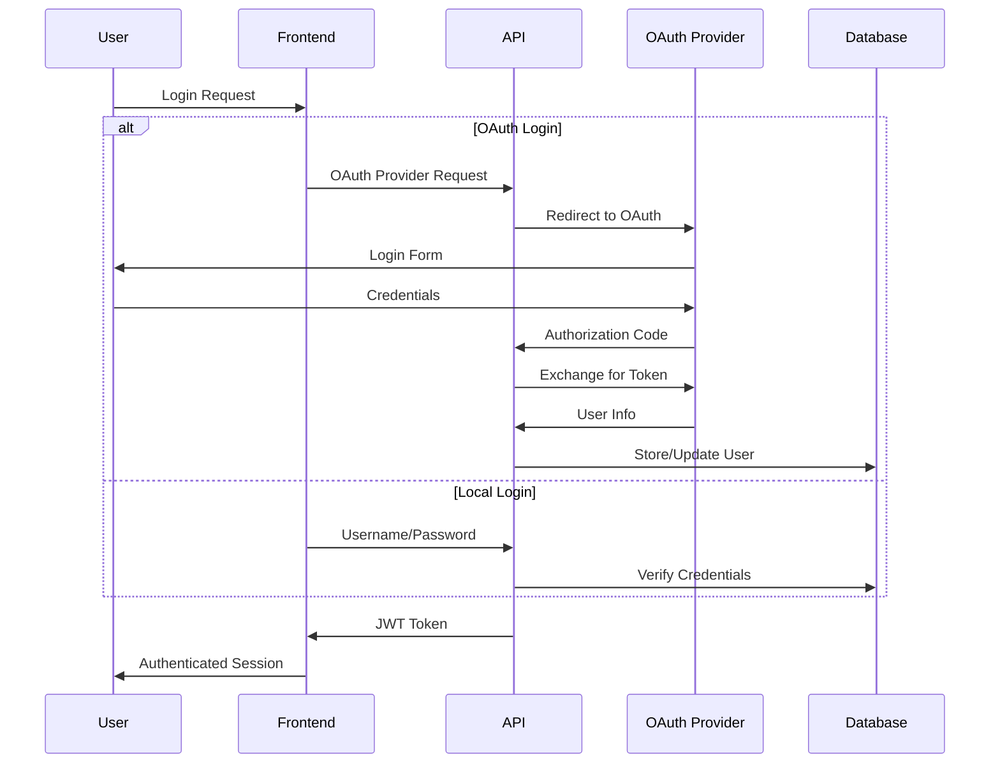

# Authentication

SafeBucket supports multiple authentication methods including local authentication and OAuth providers. This guide covers configuration for various authentication options.

## Overview

SafeBucket's authentication system provides:

- **Local Authentication**: Username/password with secure password hashing (Argon2id)
- **OAuth Integration**: Support for popular OAuth providers (Google, GitHub, custom OIDC)
- **Role-Based Access Control**: Granular permissions using Casbin RBAC
- **JWT Tokens**: Stateless authentication with configurable expiration
- **Admin Management**: Built-in admin user creation and management

## Authentication Flow



## Local Authentication

Local authentication uses email/password with secure Argon2id password hashing.

### Configuration

#### Environment Variables

```bash
# JWT Configuration
APP__JWT_SECRET=your-256-bit-secret-key

# Admin User
APP__ADMIN_EMAIL=admin@safebucket.io
APP__ADMIN_PASSWORD=ChangeMePlease
```

#### YAML Configuration

```yaml
app:
  jwt_secret: your-256-bit-secret-key
  admin_email: admin@safebucket.io
  admin_password: ChangeMePlease

auth:
  providers:
    local:
      type: local
      sharing:
        allowed: true
```

### Default Admin User

SafeBucket automatically creates an admin user on startup:

- **Email**: Configured via `APP__ADMIN_EMAIL`
- **Password**: Configured via `APP__ADMIN_PASSWORD`
- **Role**: Admin (full system access)

:::warning Security Note
**Always change the default admin password in production!**
:::

## OAuth Providers

SafeBucket supports OAuth 2.0 / OpenID Connect providers for seamless user authentication.

### Supported Providers

- **Google**: Pre-configured Google OAuth
- **GitHub**: Popular developer platform
- **Microsoft Azure AD**: Enterprise authentication
- **Custom OIDC**: Any OpenID Connect compatible provider

### Configuration Pattern

OAuth providers follow this configuration pattern:

#### Environment Variables

```bash
# Enable providers
AUTH__PROVIDERS__KEYS=google,github,custom

# Provider configuration (replace {PROVIDER} with actual provider name)
AUTH__PROVIDERS__{PROVIDER}__NAME=Display Name
AUTH__PROVIDERS__{PROVIDER}__CLIENT_ID=your-client-id
AUTH__PROVIDERS__{PROVIDER}__CLIENT_SECRET=your-client-secret
AUTH__PROVIDERS__{PROVIDER}__ISSUER=https://provider-issuer-url
```

#### YAML Configuration

```yaml
auth:
  providers:
    provider_name:
      type: oidc
      name: Display Name
      oidc:
        client_id: your-client-id
        client_secret: your-client-secret
        issuer: https://provider-issuer-url
      sharing:
        allowed: true
        allowed_domains:
          - yourdomain.com
```

## Google OAuth

Configure Google OAuth for easy user authentication.

### Prerequisites

1. **Google Cloud Console** project
2. **OAuth 2.0 Client ID** configured
3. **Authorized redirect URIs** set

### Setup Steps

1. **Create OAuth Application**:
   - Go to [Google Cloud Console](https://console.cloud.google.com)
   - Navigate to APIs & Services > Credentials
   - Create OAuth 2.0 Client ID (Web application)

2. **Configure Redirect URIs**:
   ```
   http://localhost:3001/auth/callback/google  (development)
   https://yourdomain.com/auth/callback/google (production)
   ```

3. **Get Credentials**:
   - Client ID: `123456789-abcdef.apps.googleusercontent.com`
   - Client Secret: `your-secret-key`

### Configuration

#### Environment Variables

```bash
AUTH__PROVIDERS__KEYS=google
AUTH__PROVIDERS__GOOGLE__NAME=Google
AUTH__PROVIDERS__GOOGLE__CLIENT_ID=123456789-abcdef.apps.googleusercontent.com
AUTH__PROVIDERS__GOOGLE__CLIENT_SECRET=your-client-secret
AUTH__PROVIDERS__GOOGLE__ISSUER=https://accounts.google.com
```

#### YAML Configuration

```yaml
auth:
  providers:
    google:
      type: oidc
      name: Google
      oidc:
        client_id: 123456789-abcdef.apps.googleusercontent.com
        client_secret: your-client-secret
        issuer: https://accounts.google.com
      sharing:
        allowed: true
```

## GitHub OAuth

Configure GitHub OAuth for developer-friendly authentication.

### Setup Steps

1. **Create OAuth App**:
   - Go to GitHub Settings > Developer settings > OAuth Apps
   - Click "New OAuth App"

2. **Configure Application**:
   - **Application name**: SafeBucket
   - **Homepage URL**: `https://yourdomain.com`
   - **Authorization callback URL**: `https://yourdomain.com/auth/callback/github`

3. **Get Credentials**:
   - Client ID: `your-github-client-id`
   - Client Secret: `your-github-client-secret`

### Configuration

#### Environment Variables

```bash
AUTH__PROVIDERS__KEYS=github
AUTH__PROVIDERS__GITHUB__NAME=GitHub
AUTH__PROVIDERS__GITHUB__CLIENT_ID=your-github-client-id
AUTH__PROVIDERS__GITHUB__CLIENT_SECRET=your-github-client-secret
AUTH__PROVIDERS__GITHUB__ISSUER=https://github.com
```

#### YAML Configuration

```yaml
auth:
  providers:
    github:
      type: oidc
      name: GitHub
      oidc:
        client_id: your-github-client-id
        client_secret: your-github-client-secret
        issuer: https://github.com
      sharing:
        allowed: true
```

## Custom OIDC Provider

Configure any OpenID Connect compatible provider.

### Examples

#### Authelia

```bash
AUTH__PROVIDERS__KEYS=authelia
AUTH__PROVIDERS__AUTHELIA__NAME=Authelia
AUTH__PROVIDERS__AUTHELIA__CLIENT_ID=safebucket
AUTH__PROVIDERS__AUTHELIA__CLIENT_SECRET=your-secret
AUTH__PROVIDERS__AUTHELIA__ISSUER=https://auth.yourdomain.com
```

#### Keycloak

```bash
AUTH__PROVIDERS__KEYS=keycloak
AUTH__PROVIDERS__KEYCLOAK__NAME=Keycloak
AUTH__PROVIDERS__KEYCLOAK__CLIENT_ID=safebucket
AUTH__PROVIDERS__KEYCLOAK__CLIENT_SECRET=your-secret
AUTH__PROVIDERS__KEYCLOAK__ISSUER=https://keycloak.yourdomain.com/realms/your-realm
```

#### Okta

```bash
AUTH__PROVIDERS__KEYS=okta
AUTH__PROVIDERS__OKTA__NAME=Okta
AUTH__PROVIDERS__OKTA__CLIENT_ID=your-okta-client-id
AUTH__PROVIDERS__OKTA__CLIENT_SECRET=your-okta-secret
AUTH__PROVIDERS__OKTA__ISSUER=https://your-domain.okta.com
```

## Sharing Configuration

Control which users can share files and with whom.

### Domain Restrictions

Restrict sharing to specific domains:

```yaml
auth:
  providers:
    google:
      type: oidc
      # ... oauth config ...
      sharing:
        allowed: true
        allowed_domains:
          - company.com
          - partner.org
```

### Disable Sharing

Completely disable sharing for a provider:

```yaml
auth:
  providers:
    provider_name:
      # ... oauth config ...
      sharing:
        allowed: false
```

## Role-Based Access Control (RBAC)

SafeBucket uses Casbin for role-based access control with three built-in roles:

### Built-in Roles

1. **Guest**: Read-only access to shared resources
2. **User**: Can create and share buckets, upload files
3. **Admin**: Full system access, user management

### Role Assignment

- **Local Users**: Assigned "User" role by default
- **OAuth Users**: Assigned "User" role by default  
- **Admin User**: Assigned "Admin" role automatically

### Custom Roles

You can extend the RBAC system by modifying the Casbin model and policies. See the [API documentation](../api/overview) for details on role management endpoints.

## JWT Configuration

Customize JWT token behavior:

```yaml
app:
  jwt_secret: your-256-bit-secret-key  # Must be 32+ characters
  # Additional JWT settings would go here in future versions
```

### Security Best Practices

1. **Secret Key**: Use a strong, randomly generated 256-bit key
2. **Rotation**: Rotate JWT secrets periodically
3. **Storage**: Store secrets securely (environment variables, secrets manager)

## Multiple Providers

SafeBucket supports multiple authentication providers simultaneously:

```bash
# Enable multiple providers
AUTH__PROVIDERS__KEYS=local,google,github,authelia

# Configure each provider
AUTH__PROVIDERS__GOOGLE__NAME=Google
AUTH__PROVIDERS__GOOGLE__CLIENT_ID=google-client-id
AUTH__PROVIDERS__GOOGLE__CLIENT_SECRET=google-secret
AUTH__PROVIDERS__GOOGLE__ISSUER=https://accounts.google.com

AUTH__PROVIDERS__GITHUB__NAME=GitHub  
AUTH__PROVIDERS__GITHUB__CLIENT_ID=github-client-id
AUTH__PROVIDERS__GITHUB__CLIENT_SECRET=github-secret
AUTH__PROVIDERS__GITHUB__ISSUER=https://github.com

AUTH__PROVIDERS__AUTHELIA__NAME=Company SSO
AUTH__PROVIDERS__AUTHELIA__CLIENT_ID=safebucket
AUTH__PROVIDERS__AUTHELIA__CLIENT_SECRET=authelia-secret
AUTH__PROVIDERS__AUTHELIA__ISSUER=https://auth.company.com
```

Users can choose their preferred authentication method on the login page.

## Troubleshooting

### Common Issues

#### OAuth Callback Errors

**Problem**: "redirect_uri_mismatch" error

**Solution**: Ensure redirect URIs match exactly:
- Development: `http://localhost:3001/auth/callback/{provider}`
- Production: `https://yourdomain.com/auth/callback/{provider}`

#### Invalid JWT Secret

**Problem**: Authentication fails with JWT errors

**Solution**: Ensure JWT secret is:
- At least 32 characters long
- Properly base64 encoded if using special characters
- Consistent across all application instances

#### Provider Configuration Errors

**Problem**: OAuth provider not appearing on login page

**Solution**: Check:
- Provider is listed in `AUTH__PROVIDERS__KEYS`
- All required fields are configured
- No typos in provider name/configuration keys

### Debug Authentication

Enable debug logging for authentication issues:

```bash
# Check application logs
docker-compose logs -f api | grep -i auth
```

### Test OAuth Configuration

Use these tools to test OAuth configuration:

```bash
# Test OIDC discovery endpoint
curl https://accounts.google.com/.well-known/openid_configuration

# Test custom OIDC provider
curl https://your-provider.com/.well-known/openid_configuration
```

## Security Considerations

1. **HTTPS Only**: Always use HTTPS in production
2. **Secure Secrets**: Store client secrets securely
3. **Domain Validation**: Use sharing domain restrictions
4. **Token Expiration**: Configure appropriate JWT expiration
5. **Rate Limiting**: Enable rate limiting for authentication endpoints
6. **Audit Logging**: Monitor authentication events

## Migration

### From Local to OAuth

1. **Add OAuth Provider**: Configure desired OAuth provider
2. **User Migration**: Users can link OAuth accounts to existing local accounts
3. **Disable Local**: Optionally disable local authentication

### Between OAuth Providers

1. **Add New Provider**: Configure new OAuth provider
2. **User Re-authentication**: Users need to authenticate with new provider
3. **Account Linking**: Implement account linking if needed
4. **Remove Old Provider**: Remove old provider configuration