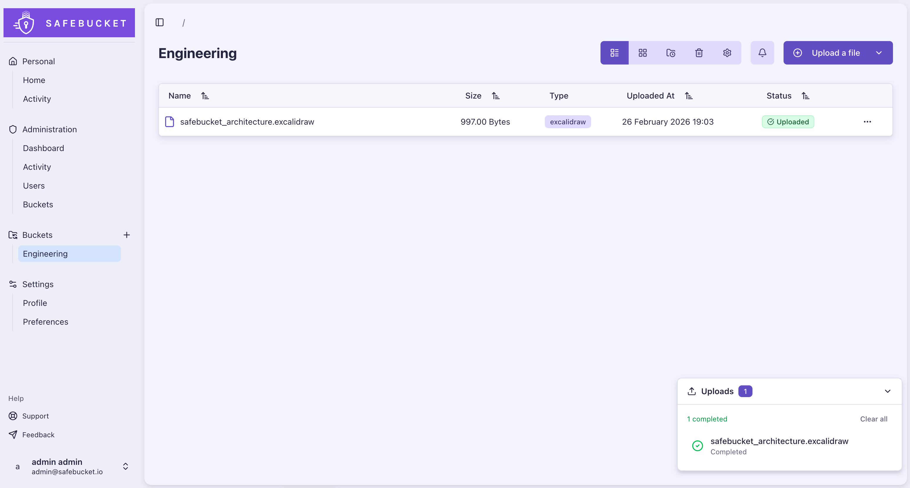
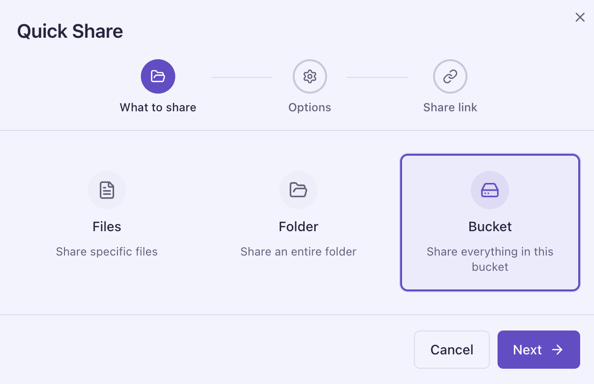
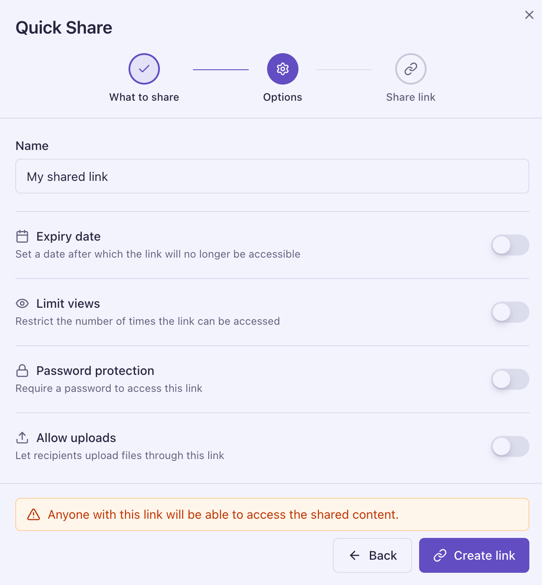
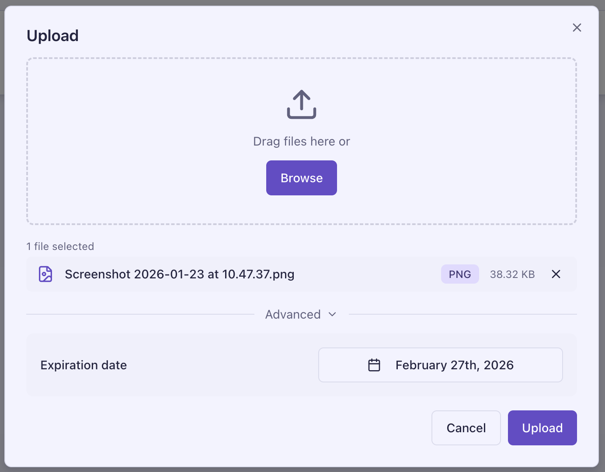
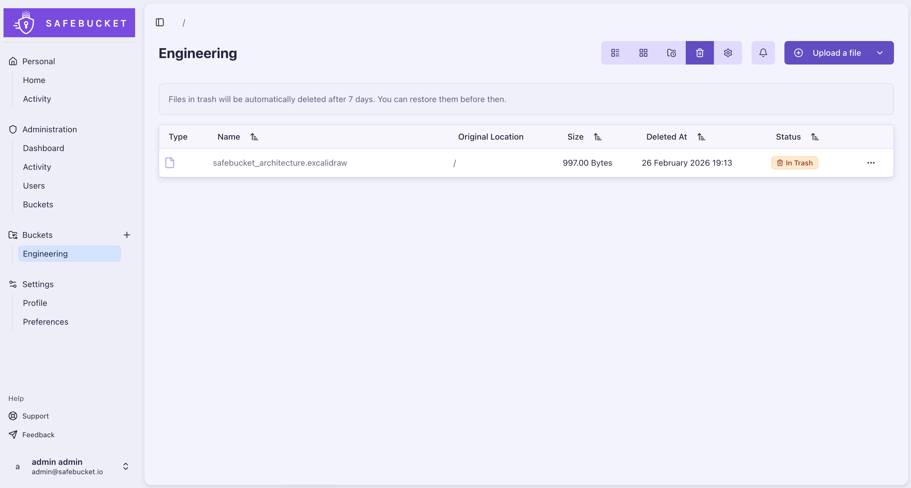
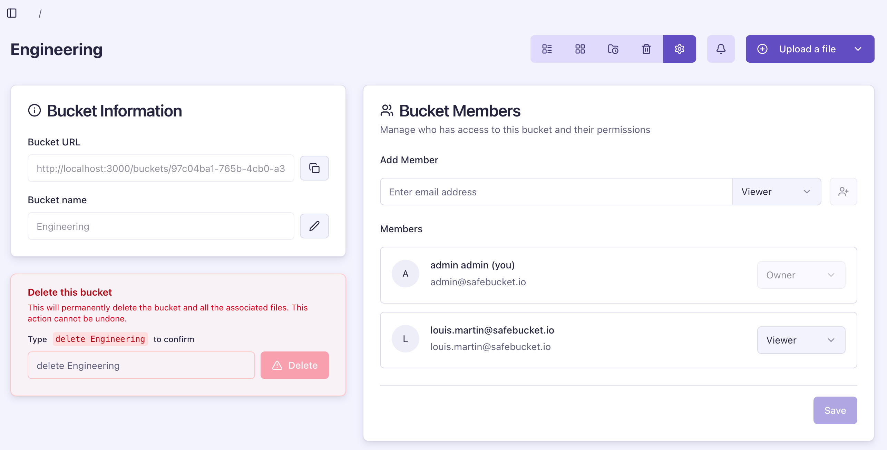
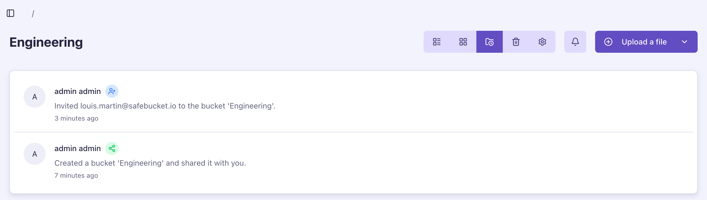
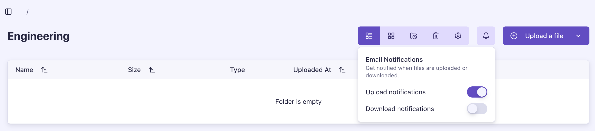
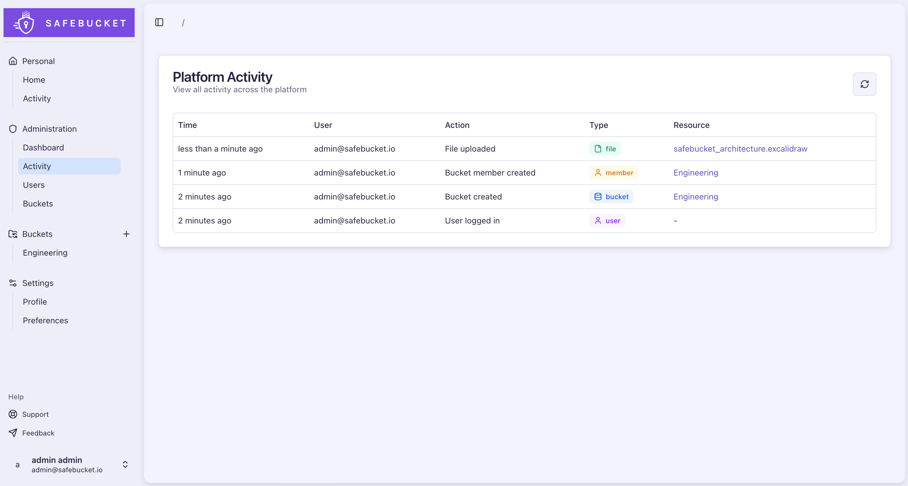
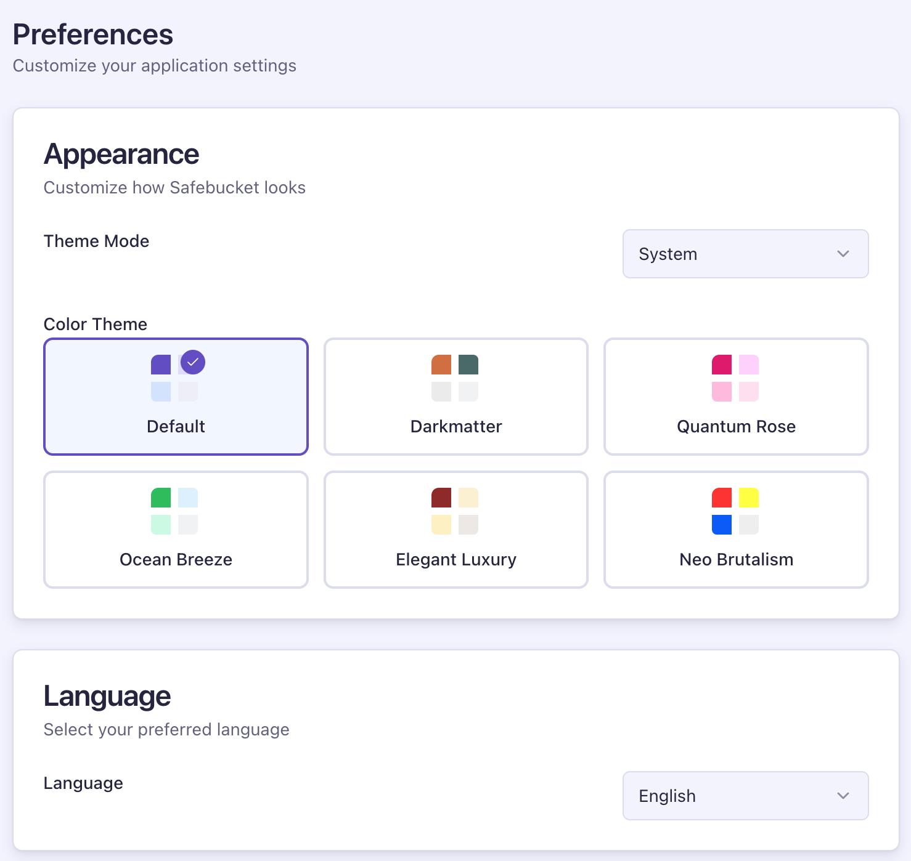

# Features

## File Sharing

### Uploads & Downloads

Files are uploaded directly to your cloud storage provider via presigned URLs.
The application server never handles file data. Clients upload and download
straight from the storage backend.

- Buckets as logical containers for sharing
- Nested folder hierarchies within buckets
- Configurable upload size limit (no hard limit)
- Time-limited presigned URLs for uploads and downloads
- File and folder renaming

### Quick Share & Reverse Share

Share files, folders, or an entire bucket via a public link. Recipients
download without a Safebucket account, and the same link can also accept
uploads back from external users.

- Three scopes: individual files, a folder, or the whole bucket
- Optional expiration date
- Optional maximum view count
- Optional password protection
- Optional reverse share available on folder and bucket shares
- Optional maximum upload count and per-file size limit on reverse shares

### File Expiration

Optional per-file expiration dates set at upload time.

- Expired files return HTTP 403 on download and update attempts
- Background worker removes expired files from storage and database
- Expiration events logged in the activity trail

### Trash & Data Retention

Soft-delete with configurable retention and automatic cleanup.

- Files and folders moved to trash on deletion
- Restore from trash before the retention period expires
- Configurable retention period (default: 7 days)
- Automatic purge after expiration

## Buckets

### Access Control

Access control operates at two levels.

**Platform roles** define what a user can do across the application:

- **Admin**: Full platform management, user administration, system-wide activity
  view
- **User**: Create buckets, manage their own buckets and memberships
- **Guest**: Can only access buckets they have been explicitly invited to.
  Cannot create buckets.

**Bucket roles** define what a member can do within a specific bucket:

- **Owner**: Full bucket management and member administration
- **Contributor**: Upload, download, rename, and delete files and folders
- **Viewer**: Read-only access

All file access is bucket-scoped. Permissions are enforced at API middleware
level on every request.

### User Invitations

Invite external users to buckets via email.

- Challenge-based acceptance flow
- Attempt limiting and lockout to prevent brute force
- Email notifications on invitation

### Activity Tracking

Real-time activity logging for all user actions.

- Logins, uploads, downloads, deletions, member changes tracked
- Searchable audit logs indexed by action, user, and object type
- Per-bucket activity view for owners
- Admin dashboard with system-wide activity and upload trends

### Notifications

Email notifications for file activity within buckets.

- Upload and download notifications to bucket members
- Per-member opt-in/opt-out preferences
- Buffered delivery to avoid spam during bulk operations

## Authentication

### SSO & Local Authentication

SSO via any OIDC provider and local password authentication for external users.

- OIDC/SSO with any OpenID Connect provider
- Local authentication for external users
- Multiple identity providers at the same time
- Domain-based restrictions per provider
- Password reset with challenge-based verification

[Configure authentication](./configuration/authentication)

### Multi-Factor Authentication

MFA for local users.

- Works with any TOTP authenticator app
- Multiple MFA devices per account
- Activate or deactivate MFA in the configuration

[Configure MFA](./configuration/mfa)

## Administration

Admin users have access to a dedicated dashboard with four views:

- **Dashboard**: Platform statistics including total users, buckets, files,
  folders, and storage used
- **Activity**: System-wide activity log
- **Users**: Full user list with roles and account status
- **Buckets**: All buckets across the platform with member counts and storage
  usage

## Personalization

- Multiple color themes: Default, Darkmatter, Quantum Rose, Ocean Breeze,
  Elegant Luxury, Neo Brutalism
- Light and dark mode with system preference detection
- Language selection (English, French)

## Infrastructure

Every component is swappable. Safebucket provides ready-to-use deployment
templates, but each layer (storage, events, cache, deployment) can be replaced
with whatever fits your environment.

**Deployment templates:**

- **local/full**: Docker Compose with all services (Safebucket, PostgreSQL,
  RustFS, Valkey, NATS, Loki, Mailpit)
- **local/lite**: Minimal Docker Compose for a lightweight setup
- **dev**: Infrastructure services only, run Safebucket from source
- **aws**: Terraform modules for ECS Fargate, RDS, ElastiCache, S3, SQS, and
  CloudWatch

[Get started](./getting-started/local-lite-deployment)
