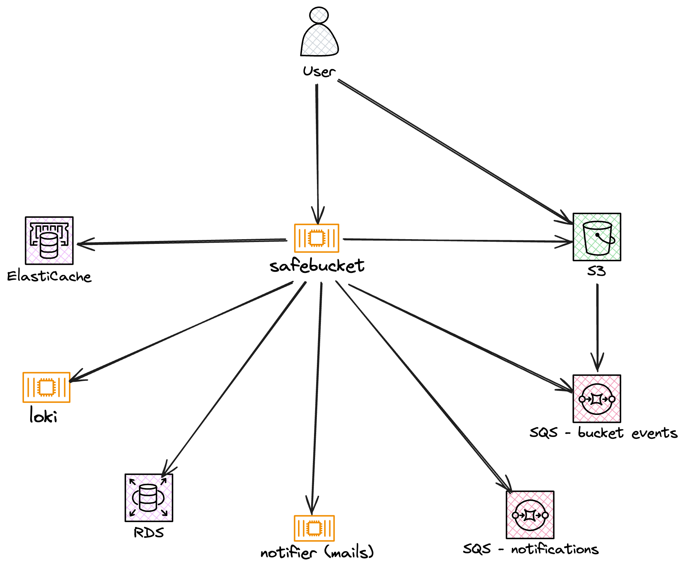

# AWS Deployment

## Architecture

## Next Steps

- [Configure OIDC providers](../configuration/authentication)
- [Set up cloud storage](../configuration/storage-providers)
- [Configure environment variables](../configuration/environment-variables)
- [Explore the API](../api/overview)
