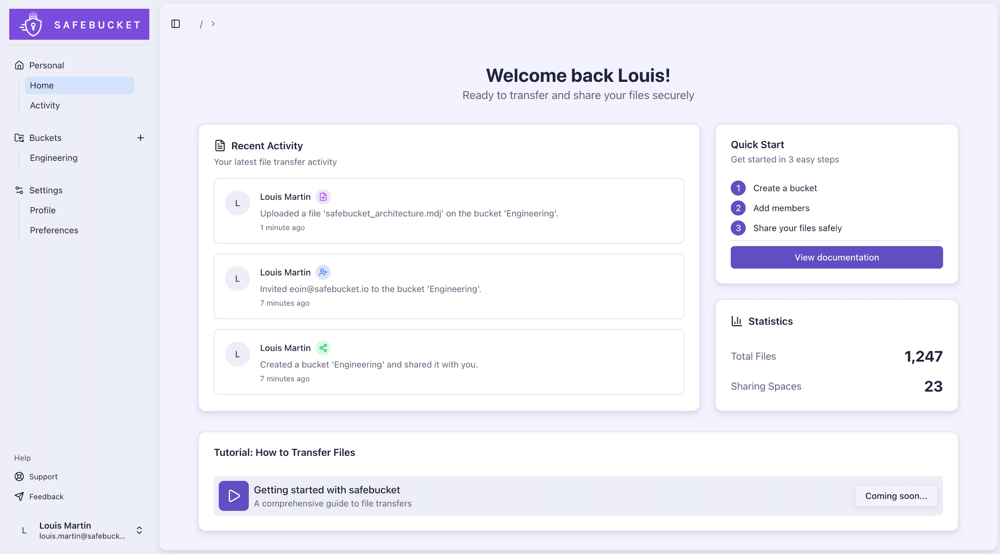
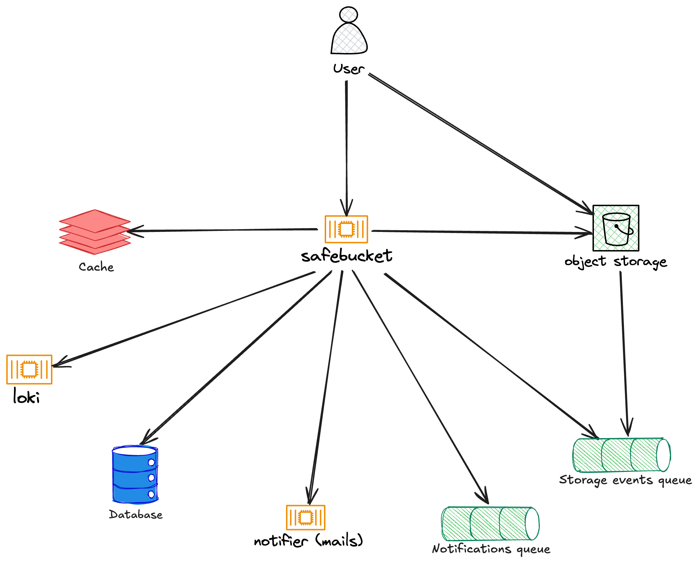

# Overview

Welcome to Safebucket, an open-source secure file sharing platform designed for easy and secure file collaboration
across multiple cloud providers.

## What is Safebucket?

Safebucket is a highly scalable secure file sharing platform that integrates with different cloud providers including
AWS S3, Google Cloud Storage, and MinIO. Built for individuals and organizations that need to collaborate on files with
robust security, flexible access controls, and seamless multi-cloud support.

## Why Safebucket?

Safebucket eliminates the complexity of secure file sharing by providing a lightweight, stateless solution that
integrates seamlessly with your existing infrastructure.
Plug in your preferred auth providers and eliminate the need for local logins - your users can share files using their
existing corporate identities.

## Features

- 🔒 **Secure File Sharing**: Create a bucket to start sharing files and folders with colleagues, customers, and teams
- 👥 **Role-Based Access Control**: Fine grained sharing permissions with owner, contributor, and viewer roles
- 🔐 **SSO Integration**: Single sign-on with any/multiple auth providers and manage their sharing capabilities
- 📧 **User Invitation System**: Invite external collaborators via email
- 📊 **Real-Time Activity Tracking**: Monitor file sharing activity with comprehensive audit trails
- ☁️ **Multi-Storage Integration**: Store and share files across AWS S3, GCP Cloud Storage, or MinIO
- 🚀 **Highly Scalable**: Event-driven and cloud native architecture for high-performance operations

## Architecture Overview

### Core Components

- **API**: Go-based REST API with Chi router providing HTTP endpoints for file operations, user management, and access
  control
- **Database**: PostgreSQL database storing users, file metadata, bucket configurations, access permissions, and
  invitation records
- **Web Interface**: React-based SPA with TypeScript for client-side file management and user interactions
- **Storage**: S3-compatible object storage with pluggable provider support (MinIO, AWS S3, GCP Cloud Storage)
- **Event System**: Asynchronous event processing via NATS JetStream, GCP Pub/Sub, or AWS SQS for decoupled operations
- **Activity Logging**: Structured audit logging via Loki with indexed queries for compliance and monitoring
- **Notifier**: Event-driven email notification service for invitation workflows and access notifications
- **Caching Layer**: Redis/Valkey (more to come) distributed cache for session management, rate limiting, and query
  result caching

### Concepts

**File Upload Architecture**: File uploads bypass the application server entirely. The API generates presigned POST URLs from the configured storage provider (S3, GCP, MinIO), allowing clients to upload directly to cloud storage. This eliminates server bandwidth bottlenecks and provides linear scalability regardless of file size or concurrent upload volume.

**Bucket-Based Access Control**: File sharing operates through buckets - logical containers with defined access policies. Users must create a bucket and explicitly add members with specific roles (owner, contributor, viewer) to grant file access. There is no global file sharing - all access is bucket-scoped with role-based permissions enforced at the API layer.

**OIDC Authentication**: The platform supports multiple OIDC providers configured simultaneously. Each provider has domain-based access controls - users from specific email domains can be restricted or allowed per provider. This enables granular organizational control over which identity providers can authenticate users from which domains.

## What's Next?

- [Get Started](./getting-started/local-deployment) - Set up Safebucket locally
- [Configuration](./configuration/environment-variables) - Configure your deployment
- [Storage Providers](./configuration/storage-providers) - Set up cloud storage
- [Authentication](./configuration/authentication) - Configure OIDC providers
