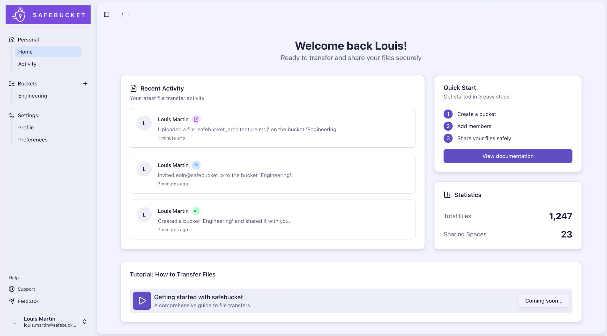
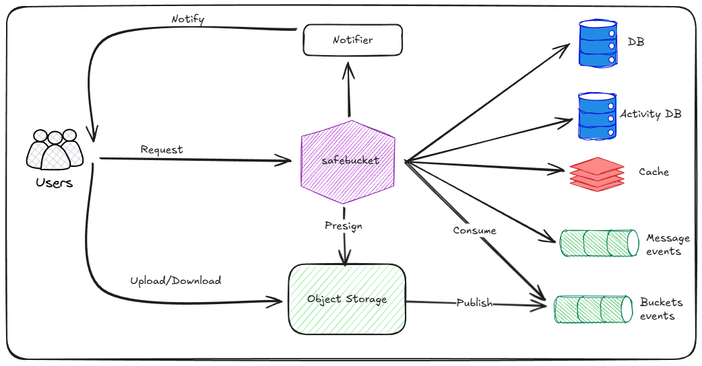

# Overview

Safebucket is an open-source file sharing platform where files never touch your
server. Uploads and downloads go directly to your storage backend via presigned
URLs. You bring your own identity provider, your own storage, and your own
infrastructure. Safebucket handles metadata, access control and audit logging.

## Why Safebucket?

- **Files bypass the server**: Clients upload and download directly from
  S3-compatible storage via presigned URLs. The API only handles metadata and
  access control.
- **SSO-first**: Authenticate users with your existing identity providers via
  OIDC. No need to manage passwords for your team.
- **Bucket-scoped access**: All sharing happens through buckets with explicit
  membership and role-based permissions (owner, contributor, viewer).
- **Swappable infrastructure**: Every component (storage, database, events,
  cache, notifier) can be replaced. Use AWS S3 or a self-hosted MinIO. Use NATS
  or SQS. Use Redis or Valkey, etc...

## Architecture

- **API**: Go REST API handling authentication, authorization, and file metadata
- **Database**: PostgreSQL/SQLite for users, buckets, files, permissions, and
  invitations
- **Web Interface**: React SPA with TypeScript
- **Storage**: S3-compatible object storage (AWS S3, GCS, MinIO, RustFS, or any
  S3-compatible provider)
- **Event System**: Asynchronous processing via NATS JetStream, AWS SQS, or GCP
  Pub/Sub
- **Activity Logging**: Structured audit logs via Loki or filesystem
- **Notifier**: Email notifications for invitations and file activity
- **Cache**: Redis, Valkey or in-memory for sessions and rate limiting

## What's Next?

- [Features](./features) - See everything Safebucket offers
- [Get Started](./getting-started/local-lite-deployment) - Set up Safebucket
  locally in 1 minute
- [Configuration](./configuration/environment-variables) - Configure your
  deployment
- [Storage Providers](./configuration/storage-providers) - Set up cloud storage
- [Authentication](./configuration/authentication) - Configure OIDC providers
